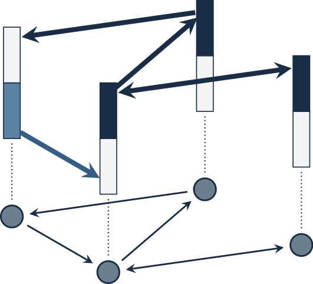

<!-- <div align="center">
</img>
</div> -->

# Welcome to DISROPT [](https://disropt.readthedocs.io/en/latest/?badge=latest)
[**Reference docs**](https://disropt.readthedocs.io/en/latest/)
| [**Install guide**](#installation)
| [**Getting started**](#getting-started)

**DISROPT** is a Python package developed within the excellence research program ERC in the project [OPT4SMART](http://www.opt4smart.eu).
The aim of this package is to provide an easy way to run distributed optimization algorithms that can 
be executed by a network of peer computing systems.

A comprehensive guide to DISROPT can be found in the [documentation](https://disropt.readthedocs.io/en/latest/).
The package is equipped with some commonly used objective functions and constraints which can be directly used.
 
**DISROPT** currently supports MPI in order to emulate peer-to-peer communication. However, custom communication protocols can be also implemented.

## Installation
**DISROPT** works on Python 3.7 and requires an MPI implementation to be installed on your system.

It relies on

* numpy
* scipy
* mpi4py
* autograd
* osqp (optional, but required for some features)
* cvxopt (optional, but required for some features)
* cvxpy (optional, but required for some features)

### pip installation
```
pip install disropt
```

## Getting started
* [Quickstart](https://disropt.readthedocs.io/en/latest/quickstart/index.html)
* [Tutorial](https://disropt.readthedocs.io/en/latest/tutorial/index.html)
  - [Distributed optimization set-ups](https://disropt.readthedocs.io/en/latest/tutorial/setups.html)
  - [Using functions and constraints](https://disropt.readthedocs.io/en/latest/tutorial/functions_constraints.html)
  - [Defining local data and problems](https://disropt.readthedocs.io/en/latest/tutorial/problems.html)
  - [Creating agents](https://disropt.readthedocs.io/en/latest/tutorial/agents.html)
  - [Algorithms](https://disropt.readthedocs.io/en/latest/tutorial/algorithms.html)
* [Examples](https://disropt.readthedocs.io/en/latest/examples/index.html)

## Citing **DISROPT**

```
@article{farina2019disropt,
  title={DISROPT: a Python Framework for Distributed Optimization},
  author={Farina, Francesco and Camisa, Andrea and Testa, Andrea and Notarnicola, Ivano and Notarstefano, Giuseppe},
  journal={arXiv},
  archivePrefix = {arXiv},
  eprint = {1911.02410},
  year={2019}
}
```

## Constributors
**DISROPT** is developed by
[Francesco Farina](https://francescofarina.github.io),
[Andrea Camisa](https://www.unibo.it/sitoweb/a.camisa),
[Andrea Testa](https://www.unibo.it/sitoweb/a.testa),
[Ivano Notarnicola](https://www.unibo.it/sitoweb/ivano.notarnicola), and
[Giuseppe Notarstefano](https://www.unibo.it/sitoweb/giuseppe.notarstefano)

## Acknowledgements
This result is part of a project that has received funding from the European Research Council (ERC) under the European Union's Horizon 2020 research and innovation programme (grant agreement No 638992 - OPT4SMART).

<p style="text-align:center">
  
   
</p>