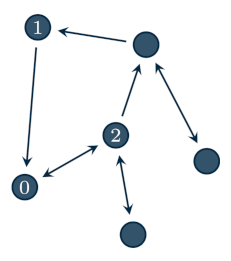

Agents in the network
===================================

The :class:`Agent` class is meant to represent the local computing units that collaborate in the network in order to solve some specific problem.

Agents are instantiated by defining their in/out-neighbors and the weights they assign their neighbors. For example, consider the following network

Then, agent 0 is defined as::

    from disropt.agents import Agent

    agent = Agent(in_neighbors=[1,2],
                  out_neighbors=[2],
                  weights=[0.3, 0.2])

Local data of an optimization problem
--------------------------------------
Assigning a local optimization problem to an agent is done via the :code:`set_problem` method,
which modifies the :class:`problem` attribute of the agent.

.. Consider the following code::

..     from disropt.problems import Problem
..     from disropt.functions import Variable, Norm

..     x = Variable(4)
..     A = np.random.randn(n, n)
..     b = np.random.randn(n, 1)

..     obj = Norm(A @ x - b)
..     constr = x >= 0

..     pb = Problem(objective_function = obj, constraints = constr)

.. Then, the variable it is assigned to the agent by::

Assume that the variable :code:`problem` contains the local problem data, according to the procedure
described in the :ref:`previous page <tutorial_problems>`. Then, the variable is assigned to the agent by::

    agent.set_problems(problem)

Local objective functions, constraints and all the operations related to the problem can be accessed
through the attribute :code:`problem`. For example::

    agent.problem.objective_function.eval(pt) # evalate the objective function at pt
    agent.problem.constraints # -> return the list of local constraints

